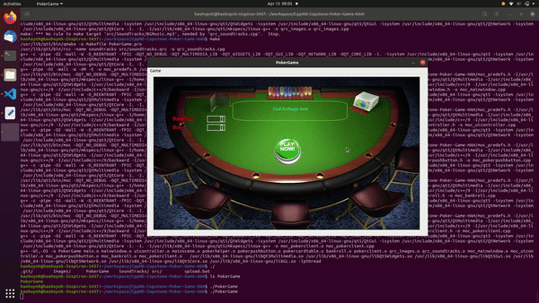
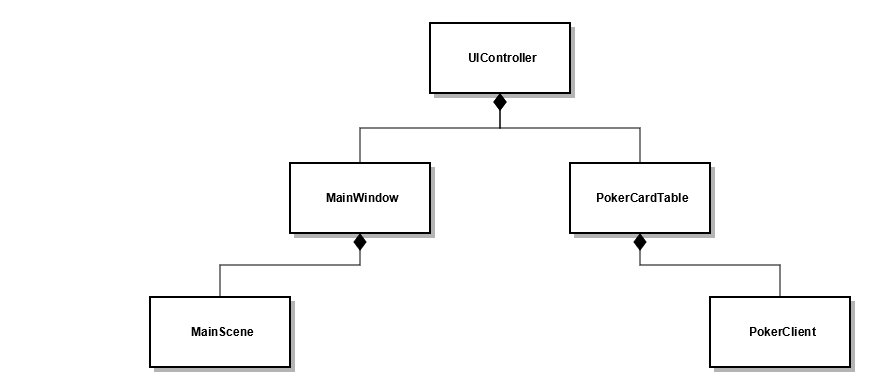

# CppND-Capstone-Poker-Game
## Please Access to ./Data/PokerGame.webm for a Full Fideo of this Demo 

## Class Diagram for Major Components 

## Install Qt Creator & Multimedia Libs
$ sudo apt-get update

$ sudo apt-get install build-essential

$ sudo apt-get install qtcreator

$ sudo apt install qt5-default

$ sudo apt-get install qtmultimedia5-dev libqt5multimediawidgets5 libqt5multimedia5-plugins libqt5multimedia5

## Create a Makefile && Make an Executable File
$ qmake PokerGame.pro

$ make

## (Optional) If there are compiling errors, please use the latest version of QMake
QMake version 3.1

Using Qt version 5.12.8 in /usr/lib/x86_64-linux-gnu

## Run PokerGame
$ ./PokerGame

## Abstract
This CPP ND Capstone project (Option 1) is built upon my previous school projects for a simple game of Poker. Even though it does not strictly followed the guidelines for game programming, especially for the Game Loop (Input, Update, and Render), it does utilize similar concepts through the usage of Qt framework. For example, users’ inputs are, indeed, the mouse events for moving the cards on the board and for clicking the buttons as well as menu items. Update happens when cards need to be replaced and to be kept track of for the scoring process. Render occurs with user’s input events as well as when final cards and results need displaying. Major classes are represented in the above class diagram through Composite relations.  There are also helper classes such as class PokerHelper (primarily for saving and loading setting files), class PokerPushButton (for button animations), class BankRoll (for the controlling dialog), and header files generated by Qt platform. Qt Creator simplify the process of creating UI, as well as of handling UI events with Connect, Signal, and Slot. Qt also make the project be wrriten in Object Oriented Programming (OOP) naturally. Last, the primary Poker engine with specific rules for scoring/checking winners is derived from the design at 
http://www.mathcs.emory.edu/~cheung/Courses/170/Syllabus/10/pokerCheck.html

## For the rubric point:
1. Read Me

2. Compiling & Testing

3. C++ Functions & Control Structures

4. Read & Write Data File

5. User Input (GUI)

6. OOP Techniques

7. Class Access Specifiers

8. Class Constructors

9. Class Destructors

10. Class Encapsulation

11. Inheritance Hierarchy (Utilized Qt)

12. Make Use of References in Function Declarations

13. Multithreading (Supported by Qt)

